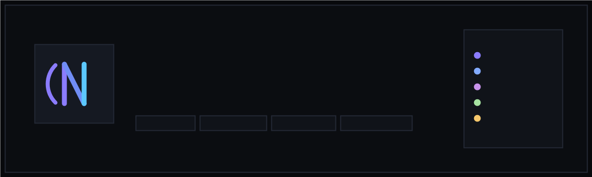
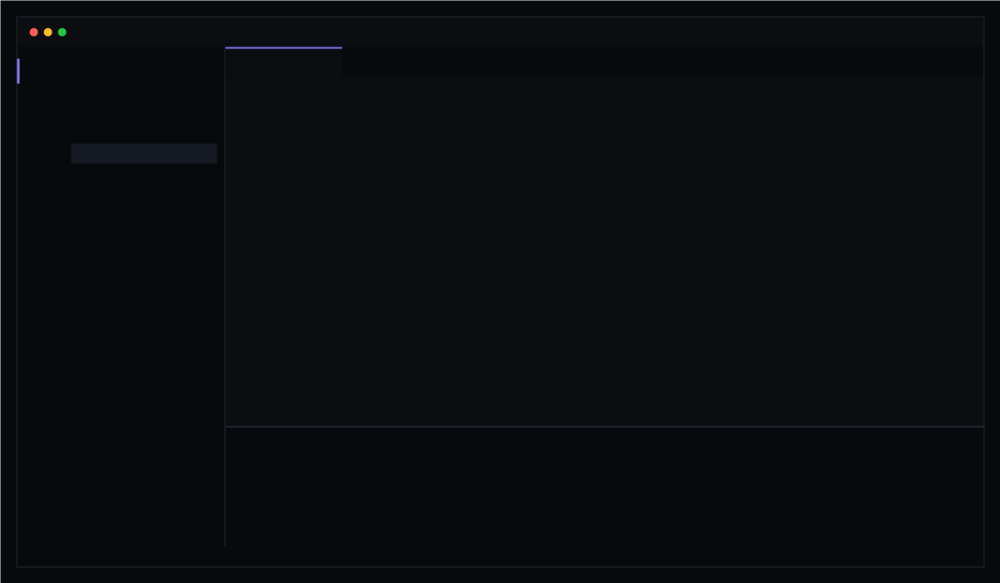
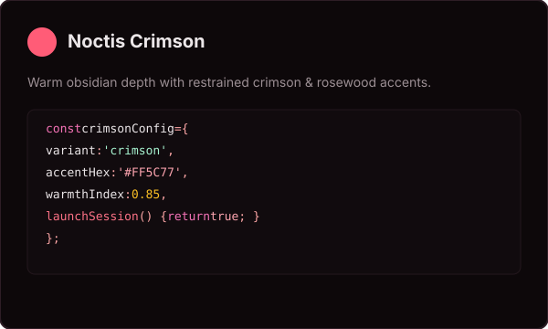
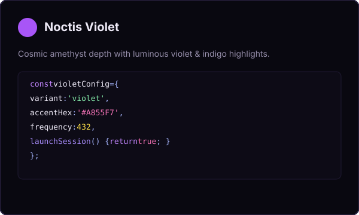
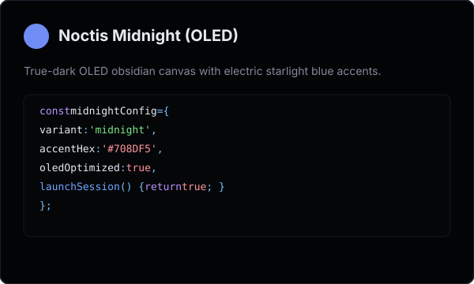

<div align="center">



<br /><br />

# Noctis

### Darkness, clarity, and code.

A dark VS Code theme engineered for deep work.

[](./LICENSE)
[](https://code.visualstudio.com/)
[](https://github.com/Henilt31/noctis-vscode)
[](./package.json)

<p>
  <a href="#the-workspace">Workspace</a> &nbsp;&bull;&nbsp;
  <a href="#four-ways-into-the-night">Variants</a> &nbsp;&bull;&nbsp;
  <a href="#designed-for-focus">Philosophy</a> &nbsp;&bull;&nbsp;
  <a href="#install">Install</a> &nbsp;&bull;&nbsp;
  <a href="#the-palette">Palette</a> &nbsp;&bull;&nbsp;
  <a href="#development">Development</a>
</p>

<p><em>Built for the quiet hours when the code is all that matters.</em></p>

</div>

---

## The workspace

Four calibrated surfaces, restrained accents, and syntax designed to stay readable when the hours get long.

<div align="center">



</div>

---

## Four ways into the night

Noctis ships with four variants built on the same geometric design system, each tuned for a distinct late-night working mood.

| Variant | Atmosphere | Canvas | Primary Accent |
| :--- | :--- | :--- | :--- |
| **Noctis** | Balanced dark workspace | `#0B0D11` | `#8B7CFF` Astral Indigo |
| **Noctis Crimson** | Warm obsidian depth | `#110B0E` | `#FF5C77` Restrained Rose |
| **Noctis Violet** | Cosmic amethyst twilight | `#0D0B16` | `#A855F7` Luminous Violet |
| **Noctis Midnight** | True-dark OLED canvas | `#050608` | `#708DF5` Electric Blue |

<br />

<p align="center">
  
  &nbsp;
  
  &nbsp;
  
</p>

* **Noctis**: The default balanced theme. Layered dark blue-grey surfaces with indigo and sky cyan guidance.
* **Noctis Crimson**: Obsidian surfaces warmed with subtle red undertones and soft crimson highlights.
* **Noctis Violet**: Ethereal purple depth with vivid violet accents for low-light flow states.
* **Noctis Midnight**: Engineered for OLED screens with near-black canvases and high-visibility starlight blue.

---

## Designed for focus

* **Quiet surfaces** &mdash; Layered dark surfaces provide tactile depth without neon borders everywhere.
* **Clear syntax** &mdash; Semantic token hierarchy ensures functions, types, and variables stand out without rainbow noise.
* **Deep contrast** &mdash; High text legibility without aggressive brightness that causes eye fatigue.
* **Consistent UI** &mdash; Editor, tabs, terminal, Git status, diff views, and breadcrumbs share a single visual grammar.
* **Long-session friendly** &mdash; Balanced comments (`#596273`), soft strings, and visible cursors made for sustained concentration.

---

## Install

Noctis can be installed directly from a packaged `.vsix` bundle or tested via the local Extension Host.

### From VSIX Package

1. Clone and package the extension:
   ```bash
   git clone https://github.com/Henilt31/noctis-vscode.git
   cd noctis-vscode
   npx @vscode/vsce package
   ```
2. Install the generated package into VS Code:
   ```bash
   code --install-extension noctis-theme-0.1.0.vsix
   ```

### Quick start

1. Open the Command Palette (<kbd>Ctrl</kbd> + <kbd>Shift</kbd> + <kbd>P</kbd> or <kbd>Cmd</kbd> + <kbd>Shift</kbd> + <kbd>P</kbd>).
2. Select **`Preferences: Color Theme`**.
3. Choose **`Noctis`** (or `Noctis Crimson`, `Noctis Violet`, `Noctis Midnight`).
4. Start coding.

---

## The palette

The core Noctis interface is structured around a four-tiered surface elevation model and functional accents:

| Role | Hex | Visual | Purpose |
| :--- | :--- | :--- | :--- |
| **Surface** | `#08090C` | `rgb(8, 9, 12)` | Sidebars, title bar, activity bar, panel |
| **Editor Canvas** | `#0B0D11` | `rgb(11, 13, 17)` | Main code editing surface |
| **Secondary Surface** | `#101319` | `rgb(16, 19, 25)` | Inactive tabs, input controls, list hover |
| **Elevated Surface** | `#151922` | `rgb(21, 25, 34)` | Quick pick, command palette, popups |
| **Border Distinct** | `#242936` | `rgb(36, 41, 54)` | Active focus borders, modal bounds |
| **Border Subtle** | `#1B2029` | `rgb(27, 32, 41)` | Structural dividers, tab separators |
| **Primary Accent** | `#8B7CFF` | `rgb(139, 124, 255)` | Active tabs, cursor, badges, buttons |
| **Secondary Accent** | `#5CC8FF` | `rgb(92, 200, 255)` | Informational alerts, modified Git files |
| **Success** | `#4ADE80` | `rgb(74, 222, 128)` | Additions, passing states |
| **Warning** | `#F5C76B` | `rgb(245, 199, 107)` | Warnings, decorators, numbers |
| **Error** | `#FF6B7A` | `rgb(255, 107, 122)` | Diagnostics, deletions |

<details>
<summary>Full syntax token mapping</summary>

<br />

| Token Category | Hex Color | Applied Scopes |
| :--- | :--- | :--- |
| **Keywords & Storage** | `#C792EA` | `import`, `export`, `function`, `const`, `return`, `class` |
| **Functions & Calls** | `#82AAFF` | Function declarations, method calls, built-ins |
| **Types & Interfaces** | `#89DDFF` | Class names, type annotations, interfaces, generics |
| **Strings** | `#A6E3A1` | Quoted strings, template literal text |
| **Numbers & Units** | `#F5C76B` | Numeric values, CSS units, decimal/hex literals |
| **Constants & Booleans** | `#FF9CAC` | `true`, `false`, `null`, `undefined`, language constants |
| **Variables & Identifiers** | `#E6E9EF` | Variable names, parameters, object properties |
| **Comments** | `#596273` | Line comments, block comments, documentation (italic) |
| **Tags & Markup** | `#F07178` | HTML tags, JSX components, XML elements |
| **Attributes** | `#C792EA` | HTML/JSX attributes, props, CSS classes |
| **Operators** | `#89DDFF` | Assignment, arithmetic, logical, arrow functions |

</details>

---

<details>
<summary>Optional recommended editor settings</summary>

<br />

Add these preferences to your VS Code `settings.json` for the cleanest typography and cursor motion:

```json
{
  "workbench.colorTheme": "Noctis",
  "editor.fontFamily": "'JetBrains Mono', 'Fira Code', 'Cascadia Code', monospace",
  "editor.fontLigatures": true,
  "editor.fontSize": 14.5,
  "editor.lineHeight": 24,
  "editor.cursorBlinking": "smooth",
  "editor.cursorSmoothCaretAnimation": "on",
  "editor.bracketPairColorization.enabled": true,
  "editor.guides.bracketPairs": "active",
  "editor.renderWhitespace": "selection",
  "workbench.tree.renderIndentGuides": "always"
}
```

</details>

---

## Language support

Noctis includes tailored TextMate scopes and tokens tested across realistic codebases:

* **Web**: TypeScript, JavaScript, HTML5, CSS3, SCSS, JSON, YAML, XML
* **Frameworks**: React (JSX/TSX)
* **Languages & Systems**: Python, Go, Rust, Java, C, C++, C#, PHP
* **DevOps & Data**: Shell/Bash, SQL, Markdown

---

## Development

To test Noctis locally and make live adjustments:

1. Clone the repository and enter the directory:
   ```bash
   git clone https://github.com/Henilt31/noctis-vscode.git
   cd noctis-vscode
   ```
2. Open the project in VS Code:
   ```bash
   code .
   ```
3. Press <kbd>F5</kbd> to launch an **Extension Development Host**.
4. In the debug window, open any file inside [`demo/`](./demo) to inspect language highlighting live.

### Validation

Run the automated validation suite to verify theme schemas, token colors, and assets:

```bash
npm test
```

### Packaging

To build a standalone `.vsix` file:

```bash
npx @vscode/vsce package
```

Outputs `noctis-theme-0.1.0.vsix` ready for installation or local distribution.

---

<details>
<summary>Project structure</summary>

<br />

```text
noctis-vscode/
├── .vscode/
│   ├── launch.json                          # F5 debug launch configuration
│   └── tasks.json                           # Workspace validation task
├── assets/
│   ├── banner.png / banner.svg              # Theme banner art
│   ├── icon.png / icon.svg                  # Extension icon
│   ├── preview.png / preview.svg            # UI mockup preview
│   └── screenshots/                         # Variant cards
├── demo/                                    # Realistic multi-language test files
├── test/
│   └── validate.js                          # Schema & token validator
├── themes/
│   ├── noctis-color-theme.json              # Noctis (Default)
│   ├── noctis-crimson-color-theme.json      # Noctis Crimson
│   ├── noctis-violet-color-theme.json       # Noctis Violet
│   └── noctis-midnight-color-theme.json     # Noctis Midnight
├── CHANGELOG.md
├── LICENSE
├── package.json
└── README.md
```

</details>

---

## Contributing

1. Fork the repository on GitHub.
2. Create your branch (`git checkout -b feature/theme-refinement`).
3. Make and test your changes in the Extension Host (<kbd>F5</kbd>).
4. Run `npm test` to verify color formatting and schemas.
5. Commit your work cleanly (`git commit -m "feat: improve rust macro highlighting"`).
6. Push to your branch and open a Pull Request.

---

## Changelog

See [CHANGELOG.md](./CHANGELOG.md) for full release history.

---

## License

[MIT](./LICENSE) &copy; 2026 Henil Thakkar

<br />

<div align="center">
  <p><strong>Noctis</strong> &mdash; Darkness, clarity, and code.</p>
  <p><small>Engineered for deep work &bull; <a href="https://github.com/Henilt31/noctis-vscode">GitHub: Henilt31/noctis-vscode</a></small></p>
</div>
