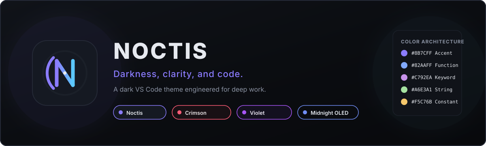
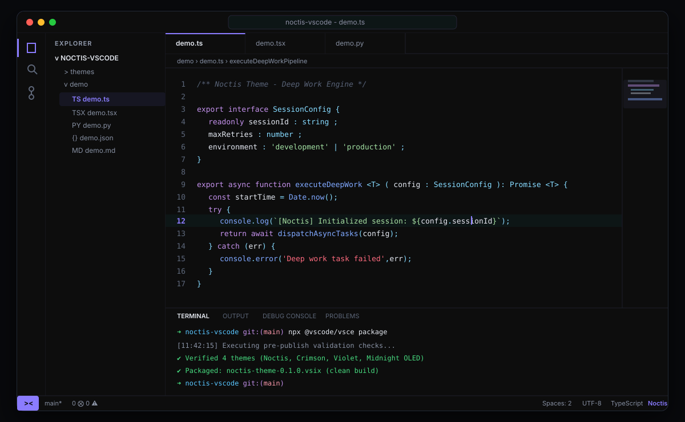

<div align="center">



# Noctis

**Darkness, clarity, and code.**

*A dark VS Code theme engineered for deep work.*

[](./package.json)
[](./LICENSE)
[](https://code.visualstudio.com/)

</div>

---

## Overview

**Noctis** is an original dark Visual Studio Code theme created for developers who spend hours in flow state. Unlike high-saturation themes that overwhelm the eyes or pure black themes that collapse visual hierarchy, Noctis uses intentional surface layering, controlled contrast, and a calm chromatic balance.

Whether writing TypeScript, refactoring Python microservices, navigating complex Git diffs, or working late into the night, Noctis keeps focus sharp and visual distractions minimal.

---

## Design Philosophy

The Noctis visual system is built on five core principles:

1. **Focus**: The editor canvas is primary; workbench chrome gracefully recedes into the background.
2. **Clarity**: Syntax tokens maintain clear typographic and semantic hierarchy without rainbow noise.
3. **Depth**: Four calibrated surface tiers provide physical structure without harsh contrast lines.
4. **Consistency**: Status bars, terminals, diff views, and quick picks all follow the same palette rules.
5. **Accessibility**: High-contrast text `#E6E9EF` against deep canvases, clearly legible comments (`#596273`), and unmistakable error/warning indicators.

---

## Palette Architecture

| Token Role | Hex Color | Visual Sample | Usage |
| :--- | :--- | :--- | :--- |
| **Primary Background** | `#08090C` | `rgb(8, 9, 12)` | Activity bar, title bar, sidebars, panel |
| **Editor Canvas** | `#0B0D11` | `rgb(11, 13, 17)` | Primary editor canvas & gutter |
| **Secondary Surface** | `#101319` | `rgb(16, 19, 25)` | Inactive tabs, inputs, list hovers |
| **Elevated Surface** | `#151922` | `rgb(21, 25, 34)` | Command palette, dropdowns, widgets |
| **Border Distinct** | `#242936` | `rgb(36, 41, 54)` | Active focus borders, modal outlines |
| **Border Subtle** | `#1B2029` | `rgb(27, 32, 41)` | Structural dividers, tab separators |
| **Foreground Main** | `#E6E9EF` | `rgb(230, 233, 239)` | Primary text, identifiers, object properties |
| **Foreground Muted** | `#8B93A3` | `rgb(139, 147, 163)` | Secondary labels, breadcrumbs, descriptions |
| **Foreground Dim** | `#5F6878` | `rgb(95, 104, 120)` | Line numbers, inactive items |
| **Primary Accent** | `#8B7CFF` | `rgb(139, 124, 255)` | Active tab borders, badges, cursor, links |
| **Secondary Accent** | `#5CC8FF` | `rgb(92, 200, 255)` | Info alerts, modified Git resources |
| **Success** | `#4ADE80` | `rgb(74, 222, 128)` | Git additions, test passed |
| **Warning** | `#F5C76B` | `rgb(245, 199, 107)` | Warnings, decorators, numbers |
| **Error** | `#FF6B7A` | `rgb(255, 107, 122)` | Compilation errors, deletions |

---

## Theme Variants

Noctis includes four carefully tuned variants within the same design system:

### 1. Noctis (Default)
The standard, balanced dark theme. Astral indigo accents paired with a calm deep workspace. Ideal for day-to-night transitions and general software engineering.

### 2. Noctis Crimson
Engineered with warm obsidian undertones and restrained rose-crimson accents (`#FF5C77`). Retains full syntax clarity while delivering a warm, focused mood.

### 3. Noctis Violet
Deep amethyst night atmosphere with luminous violet (`#A855F7`) and indigo highlights. Designed for developers who love a refined purple aesthetic without eye strain.

### 4. Noctis Midnight
An ultra-deep true-dark variant (`#030406` workbench, `#050608` canvas) tuned specifically for OLED displays and pitch-black working environments. High-legibility starlight blue accents (`#708DF5`).

---

## Preview

<div align="center">



</div>

---

## Installation

### From VS Code Extension Host (Local Development)

1. Clone or open the repository in Visual Studio Code:
   ```bash
   git clone https://github.com/Henilt31/noctis-vscode.git
   cd noctis-vscode
   code .
   ```
2. Press <kbd>F5</kbd> to launch an **Extension Development Host** window.
3. In the new window, open the Command Palette (<kbd>Ctrl</kbd> + <kbd>Shift</kbd> + <kbd>P</kbd> or <kbd>Cmd</kbd> + <kbd>Shift</kbd> + <kbd>P</kbd>).
4. Type `Preferences: Color Theme` and hit <kbd>Enter</kbd>.
5. Select any of the **Noctis** themes:
   - `Noctis`
   - `Noctis Crimson`
   - `Noctis Violet`
   - `Noctis Midnight`

### From `.vsix` Package

```bash
# Package extension locally
npx @vscode/vsce package

# Install into VS Code
code --install-extension noctis-theme-0.1.0.vsix
```

---

## Recommended Editor Settings

For the optimal deep work experience, add these settings to your VS Code `settings.json`:

```json
{
  "workbench.colorTheme": "Noctis",
  "editor.fontFamily": "'JetBrains Mono', 'Fira Code', 'Cascadia Code', monospace",
  "editor.fontLigatures": true,
  "editor.fontSize": 14.5,
  "editor.lineHeight": 24,
  "editor.cursorBlinking": "smooth",
  "editor.cursorSmoothCaretAnimation": "on",
  "editor.bracketPairColorization.enabled": true,
  "editor.guides.bracketPairs": "active",
  "editor.renderWhitespace": "selection",
  "workbench.tree.renderIndentGuides": "always"
}
```

---

## Supported Languages

Noctis includes dedicated TextMate scopes for:

- **Web**: TypeScript, JavaScript, HTML5, CSS3, SCSS, JSON, YAML, XML, GraphQL
- **Frameworks**: React (JSX/TSX), Vue, Svelte, Angular
- **Backend & Systems**: Python, Go, Rust, Java, C, C++, C#, PHP
- **DevOps & Data**: Shell/Bash, PowerShell, Dockerfile, SQL, Markdown

---

## Project Structure

```
noctis-vscode/
├── .vscode/
│   ├── launch.json              # F5 Extension Development Host configuration
│   └── tasks.json               # Schema validation tasks
├── assets/
│   ├── banner.svg               # Theme banner artwork
│   ├── preview.svg              # Mockup preview artwork
│   ├── icon.png                 # Extension marketplace icon
│   └── screenshots/             # Variant visual documentation
├── demo/                        # Realistic multi-language test files
│   ├── demo.ts                  # TypeScript
│   ├── demo.js                  # JavaScript
│   ├── demo.py                  # Python
│   ├── demo.tsx                 # React component
│   ├── demo.json                # JSON configuration
│   ├── demo.html                # HTML5 markup
│   ├── demo.css                 # CSS styles
│   ├── demo.md                  # Markdown document
│   ├── demo.sql                 # SQL query
│   └── demo.sh                  # Shell script
├── themes/
│   ├── noctis-color-theme.json          # Default Noctis
│   ├── noctis-crimson-color-theme.json  # Noctis Crimson
│   ├── noctis-violet-color-theme.json   # Noctis Violet
│   └── noctis-midnight-color-theme.json # Noctis Midnight
├── .gitignore
├── .vscodeignore
├── CHANGELOG.md
├── LICENSE
├── package.json
└── README.md
```

---

## Contributing

Contributions and feedback are welcome.

1. Fork the repository.
2. Create your feature branch (`git checkout -b feature/theme-refinement`).
3. Validate changes in the Extension Host (`F5`).
4. Ensure theme JSON schemas pass parsing (`npm run validate` or task check).
5. Commit your changes with clear semantic messages.
6. Open a Pull Request.

---

## Changelog

See [CHANGELOG.md](./CHANGELOG.md) for release notes.

---

## License

[MIT](./LICENSE) © 2026 Henil Thakkar
